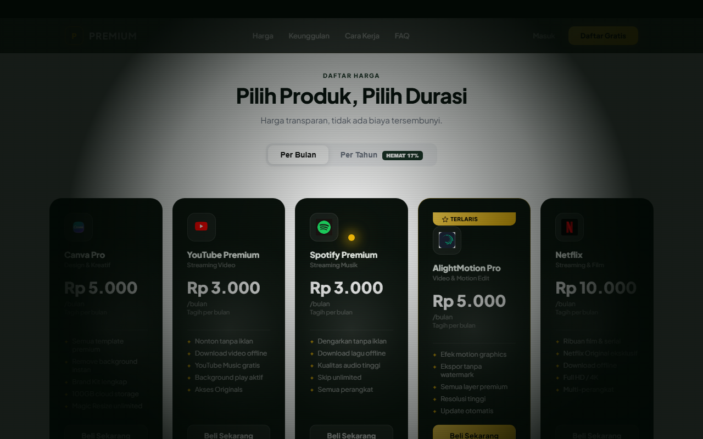
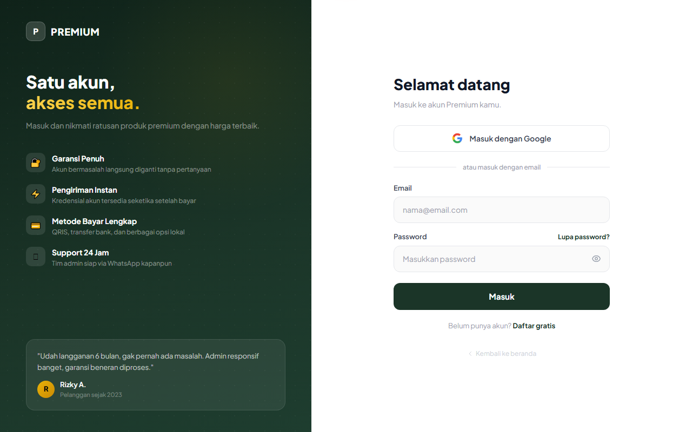
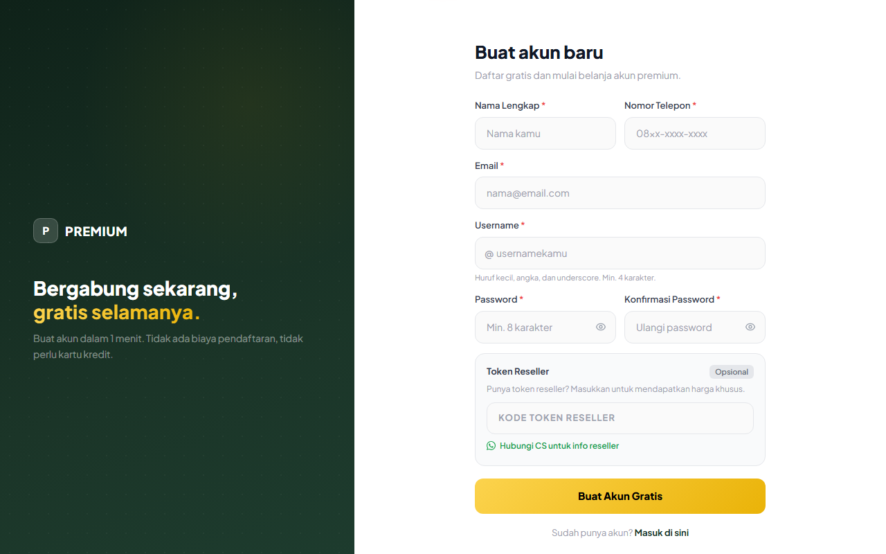

<div align="center">

# Premium Store

**A modern web platform for selling premium digital accounts, top-ups, and vouchers.**

Built with PHP, Firebase, and Midtrans - featuring buyer & admin dashboards, balance deposits, automated payments, voucher redemption, and warranty claims.

[](https://www.php.net/)
[](https://firebase.google.com/)
[](https://midtrans.com/)
[](https://tailwindcss.com/)
[](LICENSE)

</div>

---

## Screenshots

<table>
<tr>
<td width="50%"></td>
<td width="50%"></td>
</tr>
<tr>
<td width="50%"></td>
<td width="50%"></td>
</tr>
</table>

## Overview

Premium Store is a full-featured storefront for digital goods (streaming accounts, design tools, vouchers, and more). Customers register, top up their balance through an integrated payment gateway, purchase products, and file warranty claims - while admins manage products, stock, orders, payments, users, and announcements from a dedicated panel.

The frontend is server-rendered PHP styled with Tailwind CSS. Authentication and data live in Firebase (Auth + Firestore + Storage), and payments are processed by Midtrans Snap with a secure server-to-server notification webhook.

## Features

### Customer
- 🔐 **Authentication** - email/password and Google sign-in via Firebase Auth
- 💰 **Balance deposit** - automatic via Midtrans Snap (QRIS, e-wallet, bank transfer), or manual QRIS with a 1-hour payment window and AI-assisted proof review
- 🛒 **Store** - browse and buy premium products by category
- 💬 **Live chat** - Claude-powered assistant first, with one-click handoff to a human admin
- 🧾 **Order history** - track purchases and balance mutations
- 🎟️ **Voucher redemption** - redeem promo codes for balance or discounts
- 🛡️ **Warranty & claims** - submit and follow up on warranty claims
- 📦 **Stock checker** - see real-time product availability
- 🔑 **OTP helper tools** - guided account-verification assistance
- 📢 **Announcements** - read the latest store news

### Admin
- 📊 **Dashboard** - sales and activity at a glance
- 🗂️ **Product & stock management** - add products and bulk-import stock
- 💳 **Payment & order management** - review and process transactions
- 👥 **User management** - manage registered customers
- 🎫 **Voucher management** - create and track promo codes
- 🛠️ **Warranty management** - handle incoming claims
- 📣 **Announcements** - publish store-wide notices

## Tech Stack

| Layer | Technology |
|-------|-----------|
| Backend | PHP 7.4+ |
| Database & Auth | Firebase (Auth, Firestore, Storage) |
| Payments | Midtrans Snap + Notification Webhook |
| AI | Anthropic Claude - live chat assistant & deposit-proof review |
| Frontend | Server-rendered PHP, Tailwind CSS (CDN), vanilla JavaScript |
| Web server | Apache (with `.htaccess` clean URLs & hardening) |

## Project Structure

```
premium/
├── backend/                   # Server-side code
│   ├── api/                   # HTTP endpoints
│   │   ├── midtrans-create.php    # Create a Snap payment transaction
│   │   ├── midtrans-notify.php    # Midtrans payment notification webhook
│   │   └── check-payment.php      # Poll a payment's status
│   ├── config/
│   │   └── app.example.php    # Application config template
│   └── includes/              # Shared view partials (head, sidebars, footer)
│
├── frontend/                  # Client-side assets
│   ├── assets/
│   │   ├── css/style.css
│   │   └── js/
│   │       ├── firebase-init.example.js   # Firebase config template
│   │       └── utils.js
│   └── image/                 # Static brand assets
│
├── admin/                     # Admin panel pages (products, stock, orders, users…)
├── docs/screenshots/          # README images
├── examples/                  # API client samples in 20 programming languages
│
├── index.php                  # Landing page
├── login.php / register.php   # Authentication
├── dashboard-<hex>.php        # Customer dashboard
├── deposit-<hex>.php          # Balance top-up
├── toko-<hex>.php             # Store
├── pesanan-<hex>.php          # Orders
├── redeem-<hex>.php           # Voucher redemption
├── garansi-<hex>.php / klaim-garansi-<hex>.php   # Warranty & claims
├── riwayat-saldo-<hex>.php    # Balance history
├── cek-stok-<hex>.php         # Stock checker
├── tools-otp-<hex>.php        # OTP helper tools
├── pengumuman-<hex>.php       # Announcements
├── kontak-admin-<hex>.php     # Contact admin (live chat)
├── profil-<hex>.php           # Account profile
└── .htaccess                  # Apache rewrite & security rules
```

> Every authenticated page (buyer + `admin/`) carries a random hex suffix in its
> filename - e.g. `toko-e3514627bb16.php` - so URLs aren't guessable. Only the
> public entry points (`index.php`, `login.php`, `register.php`) keep plain
> names. The actual suffixes are unique to your deployment; the sidebar links
> are generated from them, never hand-typed.

## Getting Started

### Prerequisites
- PHP 7.4 or newer with the cURL extension enabled
- An Apache server (or any host that supports `.htaccess` - e.g. Hostinger)
- A [Firebase](https://firebase.google.com/) project (Auth + Firestore enabled)
- A [Midtrans](https://midtrans.com/) account (Snap enabled)

### Installation

1. **Clone the repository**
   ```bash
   git clone https://github.com/damta8827773/premium.git
   cd premium
   ```

2. **Create your configuration files** (these hold secrets and are git-ignored)
   ```bash
   cp backend/config/app.example.php backend/config/app.php
   cp frontend/assets/js/firebase-init.example.js frontend/assets/js/firebase-init.js
   ```

3. **Fill in your credentials**
   - `backend/config/app.php` - Midtrans server/client keys, admin WhatsApp numbers, app URL
   - `frontend/assets/js/firebase-init.js` - your Firebase web config

4. **Configure the Midtrans webhook**
   In the Midtrans Dashboard → *Settings → Configuration*, set the
   **Payment Notification URL** to:
   ```
   https://yourdomain.com/backend/api/midtrans-notify.php
   ```

5. **Deploy** the project to your web server's public directory and open it in a browser.

## Configuration Reference

| Key | File | Description |
|-----|------|-------------|
| `MIDTRANS_SERVER_KEY` | `backend/config/app.php` | **Secret.** Server-side Midtrans key used to sign requests. |
| `MIDTRANS_CLIENT_KEY` | `backend/config/app.php` | Public client key used by Snap on the frontend. |
| `MIDTRANS_IS_PRODUCTION` | `backend/config/app.php` | `true` for live, `false` for sandbox. |
| `ADMIN_WA_1` / `ADMIN_WA_2` | `backend/config/app.php` | Admin WhatsApp contact numbers. |
| `firebaseConfig` | `frontend/assets/js/firebase-init.js` | Firebase web app configuration. |

## API

### Create a payment transaction
`POST /backend/api/midtrans-create.php`

**Request body**
```json
{
  "order_id": "DEP-1700000000",
  "amount": 50000,
  "user_id": "firebase-uid",
  "email": "customer@example.com",
  "name": "Customer Name"
}
```

**Response**
```json
{
  "token": "66e4fa55-fdac-4ef9-91b5-733b97d1b862",
  "redirect_url": "https://app.midtrans.com/snap/v3/redirection/..."
}
```

> Ready-to-use client samples for this endpoint are available in
> [`examples/`](examples/) across **20 programming languages**.

### Payment notification (webhook)
`POST /backend/api/midtrans-notify.php` - called by Midtrans. The signature is verified
server-side (`sha512` of `order_id + status_code + gross_amount + server_key`)
before any payment is accepted.

### Check payment status
`GET /backend/api/check-payment.php?order_id=DEP-1700000000`

## Security

- 🔒 Real credentials live only in `backend/config/app.php` and `frontend/assets/js/firebase-init.js`, both **git-ignored** - never commit them.
- 🧾 Midtrans webhook requests are verified with a SHA-512 signature before processing.
- 🚫 `.htaccess` blocks direct access to `backend/config/`, `temp/`, and dotfiles, and prevents PHP execution inside `uploads/`.
- ✅ If a credential is ever exposed, rotate it immediately from the provider dashboard.

## License

Released under the [MIT License](LICENSE).
